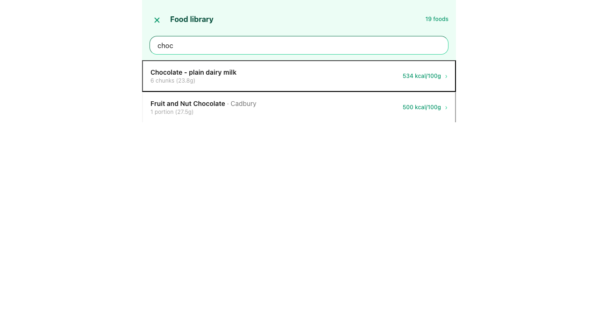
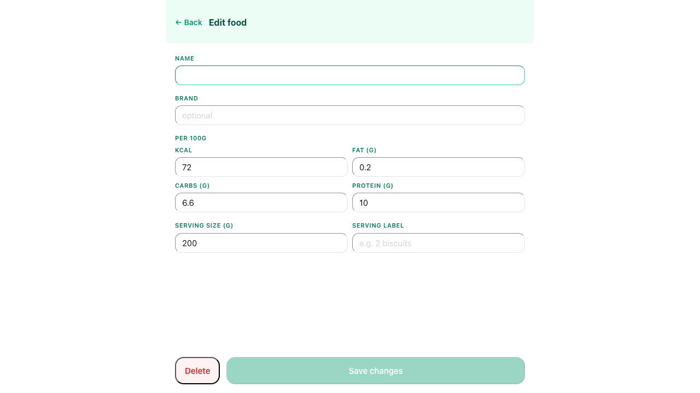
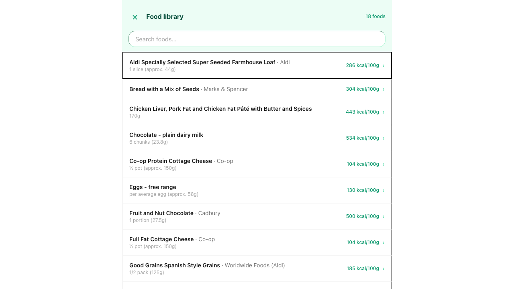

# UAT Report — Edit Saved Foods

**Date:** 2026-05-12
**Tester:** Claude (Playwright MCP, headless Chromium)
**Profile:** Test / test

## Results

| # | Scenario | Result | Notes |
|---|----------|--------|-------|
| TC-01 | Access food library | ✅ PASS | Dialog opened, 19 foods listed alphabetically, count shown in header |
| TC-02 | Real-time search | ✅ PASS | "choc" filtered to 2 results instantly; clearing restored all 19 |
| TC-03 | Edit a food's macros | ✅ PASS | Changed Protein Yogurt kcal 72→75; list updated immediately. Reverted to 72 post-test. |
| TC-04 | Edit a food's serving info | ✅ PASS | Changed serving size 200→175g, added label "1 small pot"; both reflected in list immediately. Reverted post-test. |
| TC-05 | Validation: name required | ✅ PASS | Save button disabled immediately on empty Name; header changes to "Edit food". No inline error message (by design per app.md). |
| TC-06 | Delete with two-step confirmation | ✅ PASS | Confirmation shown; confirmed delete; food absent from list, count dropped to 18. |
| TC-07 | Delete cancellation | ✅ PASS | Confirmation appeared; Cancel returned to edit view; food still present in list (19 foods). |

## Evidence

### TC-01 — Access food library

### TC-02 — Real-time search

### TC-03 — Edit a food's macros

### TC-04 — Edit a food's serving info

### TC-05 — Validation: name required

### TC-06 — Delete with two-step confirmation

### TC-07 — Delete cancellation

## Summary

**7 / 7 scenarios passed.** All food library CRUD operations work as specified:
- The overlay opens correctly and lists foods alphabetically with a count in the header
- Search filters in real time; clearing restores the full list
- Edits to macros and serving info persist immediately in the list view
- The Name field is required; Save is disabled (not merely warned) when it is empty
- Delete requires explicit two-step confirmation; cancellation leaves data intact
- Confirmed delete removes the item from the list immediately and decrements the count

**Note:** TC-06 and TC-07 were executed against "Protein Yogurt" renamed to "Protein Yogurt UAT Delete Me" per the shared-data artefact protocol. That entry is now permanently deleted from the shared database.
