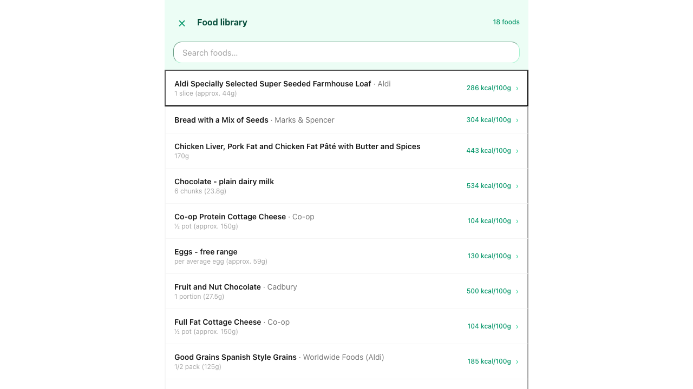
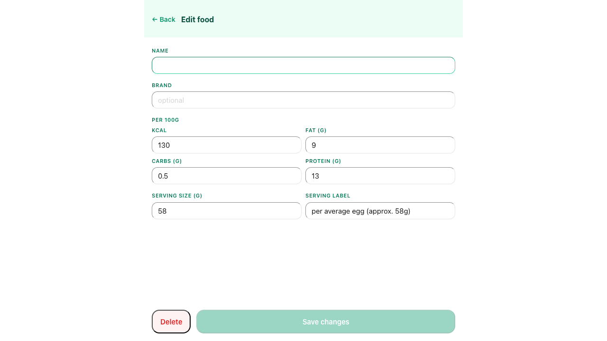
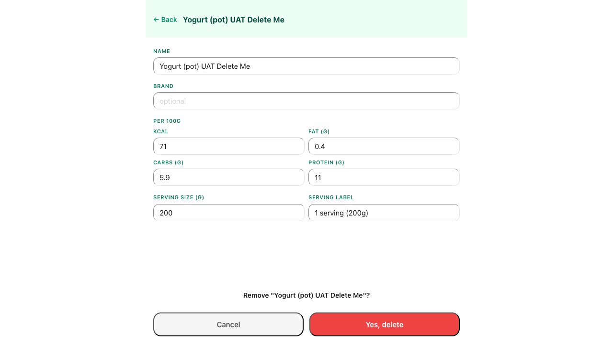
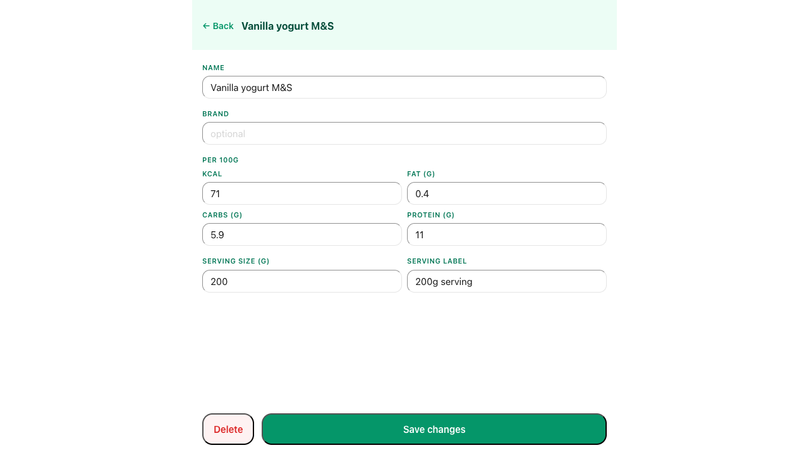

# UAT Report — Edit Saved Foods
**Date:** 2026-05-12
**Tester:** Claude (Playwright MCP, headless Chromium)
**Profile:** Test

## Results

| # | Scenario | Result | Notes |
|---|----------|--------|-------|
| TC-01 | Access food library | ✅ PASS | Full-screen overlay opened; 18 foods listed alphabetically; count shown in header |
| TC-02 | Real-time search | ✅ PASS | "choc" filtered to 2 results instantly; clearing restored all 18 |
| TC-03 | Edit a food's macros | ✅ PASS | Changed Eggs kcal 130→131; list updated immediately; restored to 130 |
| TC-04 | Edit a food's serving info | ✅ PASS | Changed serving size 58→59g and label; list reflected changes immediately; restored |
| TC-05 | Validation: name required | ✅ PASS | Save changes button disabled immediately when Name cleared; header changes to "Edit food"; no error message shown |
| TC-06 | Delete with two-step confirmation | ✅ PASS | Confirmation prompt shown; confirmed; food gone from list; count dropped to 17 |
| TC-07 | Delete cancellation | ✅ PASS | Confirmation shown; cancelled; edit form remained open; food present in list |

## Evidence

### TC-01 — Access food library

### TC-02 — Real-time search

### TC-03 — Edit a food's macros

### TC-04 — Edit a food's serving info

### TC-05 — Validation: name required

### TC-06 — Delete with two-step confirmation

### TC-07 — Delete cancellation

---
**Summary:** All 7 scenarios passed. Food library is fully functional — access, search, macro edits, serving edits, name validation, and two-step delete (confirm and cancel) all behave as specified. DB note: "Yogurt (pot) UAT Delete Me" was deleted as a test artefact; library now has 17 foods.
