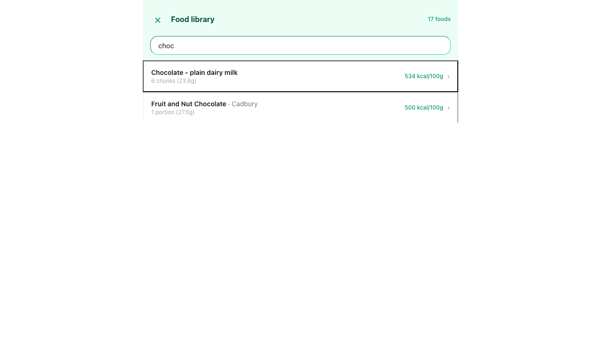
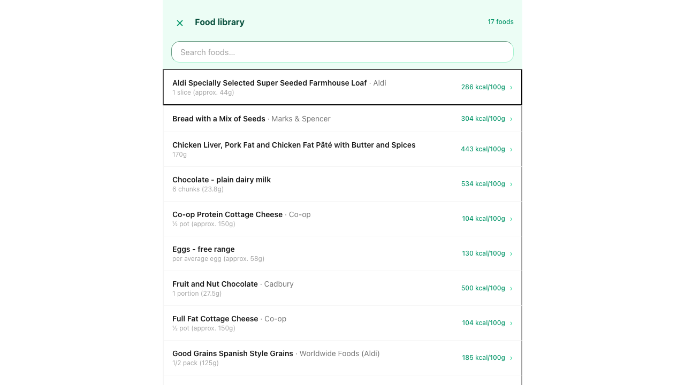
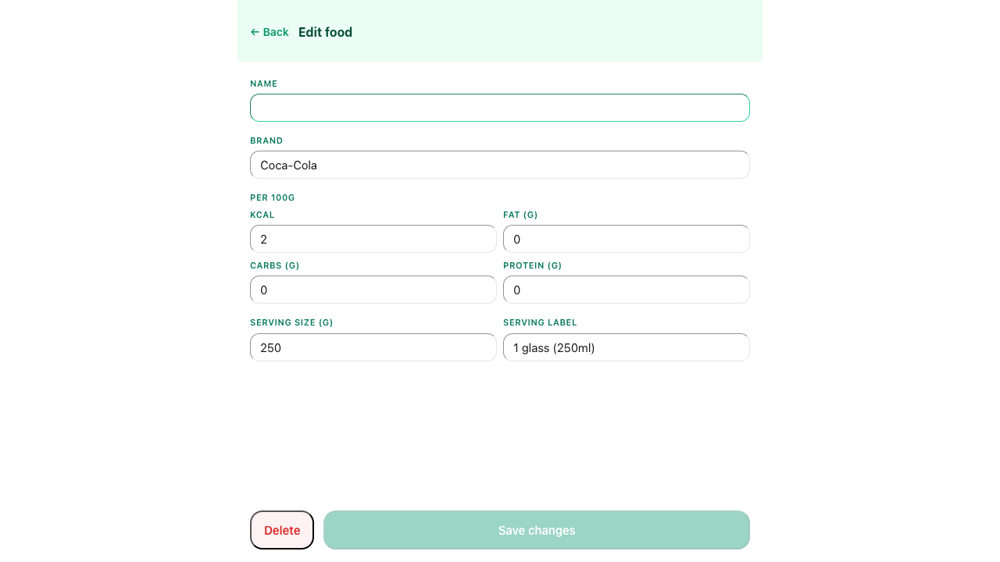
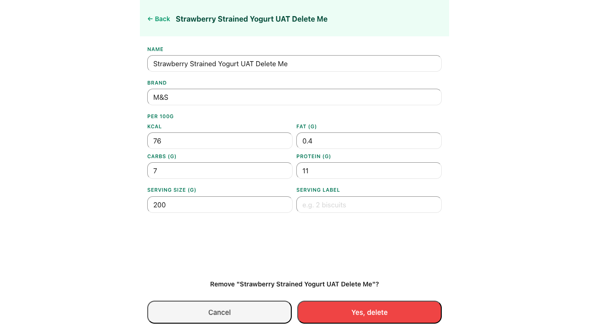

# UAT Report — Edit Saved Foods
**Date:** 2026-05-13 09:00:00
**Tester:** Claude (Playwright MCP, headless Chromium)
**Profile:** Test
**Test duration:** ~10 minutes

## Results

| # | Scenario | Result | Notes |
|---|----------|--------|-------|
| TC-01 | Access food library | ✅ PASS | Full-screen overlay opened; 17 foods listed alphabetically; count shown in header |
| TC-02 | Real-time search | ✅ PASS | "choc" filtered to 2 matching items; clearing search restored all 17 foods |
| TC-03 | Edit a food's macros | ✅ PASS | Changed Eggs kcal/100g from 130→135; list reflected update immediately; restored to 130 |
| TC-04 | Edit a food's serving info | ✅ PASS | Changed Vanilla yogurt M&S serving 200g→150g and label; list reflected update; restored |
| TC-05 | Validation: name required | ✅ PASS | Save button disabled when Name cleared; header changed to "Edit food"; no inline error message shown |
| TC-06 | Delete with two-step confirmation | ✅ PASS | Confirmation prompt shown; "Yes, delete" removed food; count dropped from 17→16 |
| TC-07 | Delete cancellation | ✅ PASS | Cancel at confirmation left food in list; count remained at 17 |

## Evidence

### TC-01 — Access food library

### TC-02 — Real-time search

### TC-03 — Edit a food's macros

### TC-04 — Edit a food's serving info

### TC-05 — Validation: name required

### TC-06 — Delete with two-step confirmation

### TC-07 — Delete cancellation

---

## Summary

All 7 scenarios passed. The food library edit and delete flows work correctly. One minor UX observation: the Save button is disabled when Name is empty (correct behaviour) but there is no inline error message explaining why — the header changes to "Edit food" which serves as implicit feedback but may not be obvious to all users.
